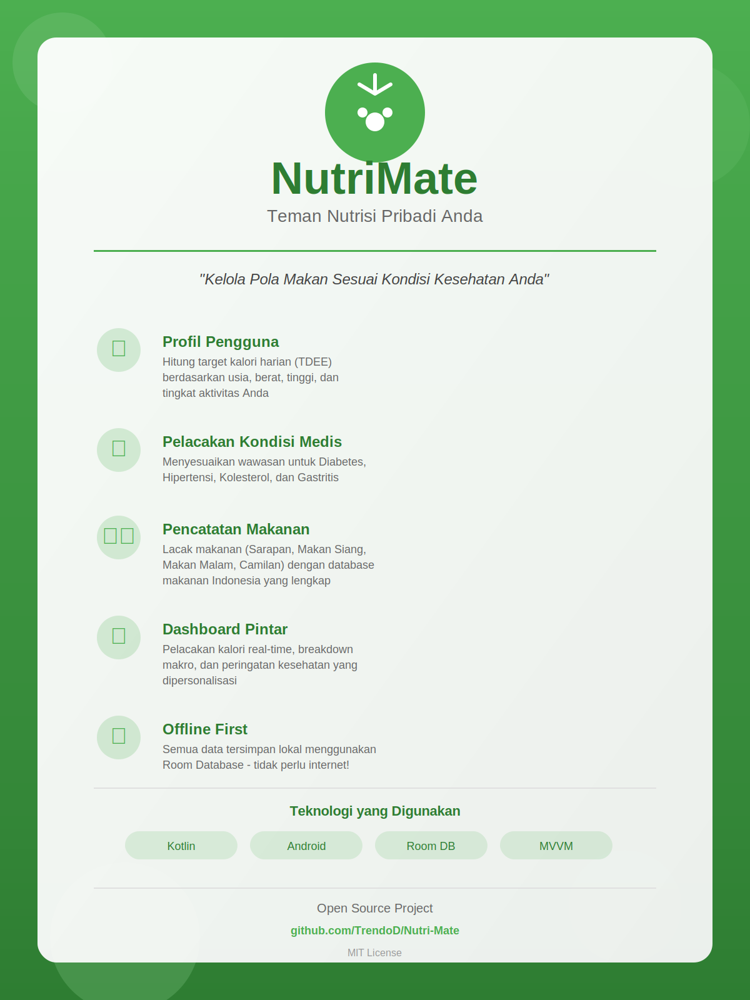

# Poster Promosi NutriMate

## Tentang Poster

Poster ini dibuat untuk menjelaskan dan mempromosikan aplikasi **NutriMate** - sebuah aplikasi pendamping nutrisi pribadi yang dirancang untuk membantu pengguna mengelola pola makan berdasarkan kondisi medis mereka.

## File Poster

- **File**: `POSTER_NUTRIMATE.svg`
- **Format**: SVG (Scalable Vector Graphics)
- **Dimensi**: 1200 x 1600 piksel
- **Bahasa**: Indonesia

## Isi Poster

Poster ini mencakup informasi lengkap tentang NutriMate:

### 1. **Identitas Aplikasi**
   - Logo NutriMate
   - Nama aplikasi dan tagline
   - Deskripsi singkat

### 2. **Fitur Utama**
   - 👤 **Profil Pengguna**: Perhitungan target kalori harian (TDEE) berdasarkan data pribadi
   - 🏥 **Pelacakan Kondisi Medis**: Menyesuaikan wawasan untuk Diabetes, Hipertensi, Kolesterol, dan Gastritis
   - 🍽️ **Pencatatan Makanan**: Database makanan Indonesia yang lengkap dengan tracking untuk semua waktu makan
   - 📊 **Dashboard Pintar**: Pelacakan kalori real-time dengan breakdown makro dan peringatan kesehatan
   - 💾 **Offline First**: Semua data tersimpan lokal menggunakan Room Database

### 3. **Teknologi yang Digunakan**
   - Kotlin
   - Android
   - Room Database
   - MVVM Architecture

### 4. **Informasi Proyek**
   - Link GitHub repository
   - Lisensi (MIT)
   - Status open source

## Cara Menggunakan Poster

### Untuk Promosi
1. Gunakan poster ini di media sosial, presentasi, atau dokumentasi proyek
2. Poster dapat di-embed langsung di file README atau website
3. Format SVG memungkinkan scaling tanpa kehilangan kualitas

### Untuk Konversi Format
Anda dapat mengkonversi SVG ke format lain jika diperlukan:

```bash
# Konversi ke PNG (memerlukan Inkscape atau ImageMagick)
inkscape POSTER_NUTRIMATE.svg --export-filename=POSTER_NUTRIMATE.png --export-width=1200

# Atau menggunakan ImageMagick
convert -density 300 POSTER_NUTRIMATE.svg POSTER_NUTRIMATE.png

# Konversi ke PDF
inkscape POSTER_NUTRIMATE.svg --export-filename=POSTER_NUTRIMATE.pdf
```

### Untuk Menampilkan di README
Tambahkan kode berikut di file README:

```markdown

```

### Untuk Melihat di Browser
Buka file SVG langsung di browser web modern (Chrome, Firefox, Safari, Edge).

## Kustomisasi

File SVG dapat dengan mudah diedit menggunakan:
- Adobe Illustrator
- Inkscape (gratis dan open source)
- Figma
- Editor teks (untuk perubahan minor)

## Tentang NutriMate

NutriMate adalah aplikasi Android yang membantu pengguna:
- Menghitung kebutuhan kalori harian
- Melacak asupan makanan dengan database makanan Indonesia
- Mendapatkan peringatan kesehatan berdasarkan kondisi medis
- Memantau progress diet dengan dashboard real-time
- Menyimpan semua data secara lokal untuk privasi maksimal

## Lisensi

Poster ini mengikuti lisensi yang sama dengan proyek NutriMate (MIT License).

## Kontribusi

Jika Anda ingin memperbaiki atau meningkatkan poster ini, silakan:
1. Fork repository
2. Buat branch baru untuk perubahan Anda
3. Submit pull request dengan deskripsi perubahan

---

**Repository**: https://github.com/TrendoD/Nutri-Mate  
**Lisensi**: MIT License
