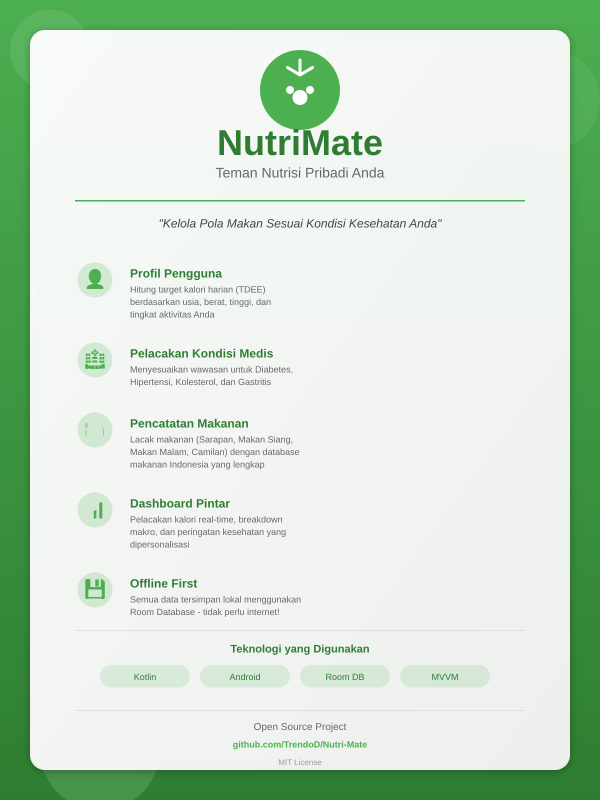

# NutriMate

NutriMate is a personal nutrition companion app designed to help users manage their diet based on their medical conditions.

## 📊 Promotional Poster

*For full size poster, see [POSTER_NUTRIMATE.svg](./POSTER_NUTRIMATE.svg) or [POSTER_NUTRIMATE.png](./POSTER_NUTRIMATE.png)*

For detailed information about the poster, including how to use and customize it, please see [POSTER_README.md](./POSTER_README.md).

## Features

- **User Profile Management**: Calculate Daily Calorie Target (TDEE) based on age, weight, height, gender, and activity level.
- **Medical Condition Tracking**: Tailors insights for Diabetes, Hypertension, Cholesterol, and Gastritis.
- **Food Logging**: Track meals (Breakfast, Lunch, Dinner, Snack) with a localized Indonesian food database.
- **Smart Dashboard**: Real-time calorie tracking, macro breakdown, and personalized health warnings.
- **Offline First**: All data is stored locally using Room Database.

## Tech Stack

- **Language**: Kotlin
- **UI**: XML Layouts & Material Design
- **Architecture**: MVVM (simplified)
- **Database**: Room (SQLite)
- **Data Format**: JSON (Food Database)

## Setup Instructions

1.  Clone the repository.
2.  Open in Android Studio Ladybug or newer.
3.  Sync Gradle project.
4.  Run on an Emulator or Physical Device (Min SDK 24).

## How to Use

1.  **Register/Login**: Create an account.
2.  **Setup Profile**: Enter your physical details and any medical conditions.
3.  **Dashboard**: View your daily targets.
4.  **Track Food**: Click "Track Food" -> Select Meal -> Search for food (e.g., "Nasi Goreng") -> Add to log.
5.  **View Insights**: Check the dashboard for warnings (e.g., high sugar intake for diabetics).

## Future Improvements

- Delete food log items.
- Custom food entry.
- Historical charts/graphs.

## License

MIT License
